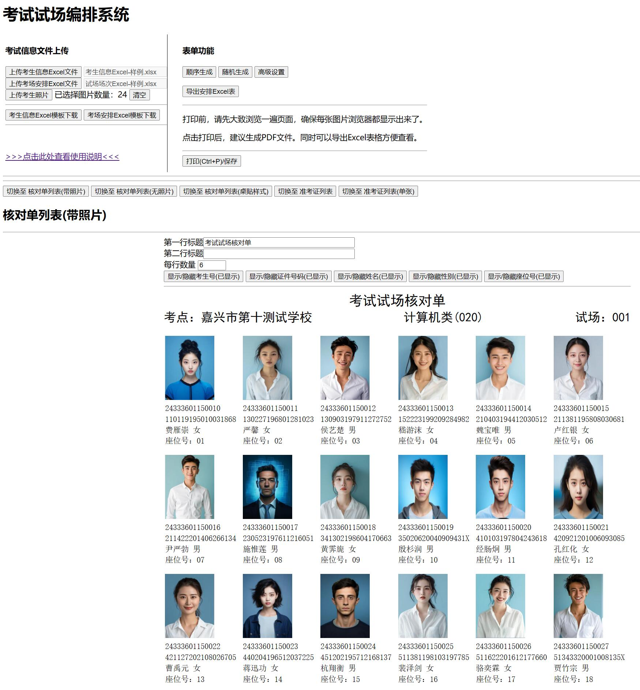
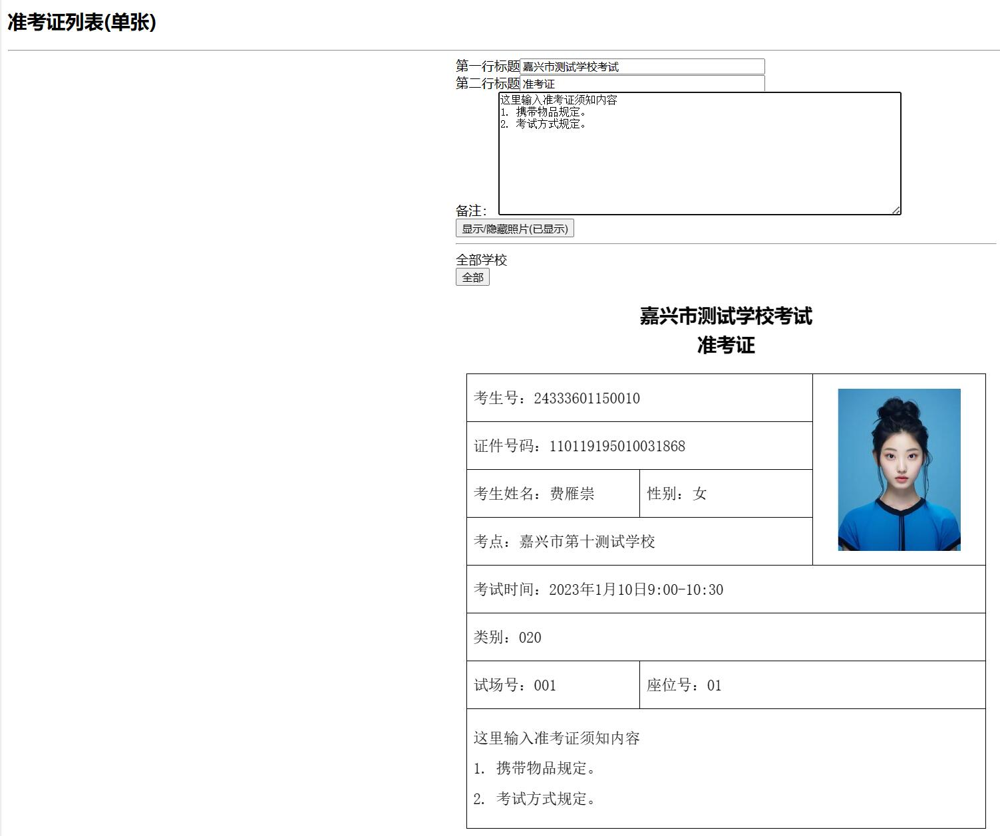

# 考场编排系统简要说明
## 系统架构
### 前端
- 基于简单的 `Vue.js` 框架，不使用 `Vue-cli` 和 `WebPack`。
### 后端
- 基于 `Java 21` 的 `Spring Boot` 3.x 框架。
# 系统使用
## 源码编译以及运行
### 编译
请使用 `IntelliJ IDEA` Clone 本项目，并设置 JDK 版本为 21，然后使用 `Maven` 编译。本项目没有特殊依赖，可以直接刷新 `Maven` 依赖即可完成编译。
### 运行
构建并运行本程序，浏览器默认端口号为 13322，直接访问 `http://127.0.0.1:13322` 即可访问本程序。
## 直接运行
从 release 处下载最新的 release 版本的 jar 包程序，并在本地已有 JDK 21，使用命令 `java -jar xxxxxx.jar` 即可启动。浏览器默认端口号为 13322，直接访问 `http://127.0.0.1:13322` 即可访问本程序。
# 系统截图
下图示例的人像图片均为 ai 生成。
### 首页核对单页面

### 首页-准考证单张

# 更新历史
v 1.6.0
- 删除 JavaFX 界面，改为 Web 界面。
- 将上传图片改为直接前端进行选择，支持嵌套文件夹。
- 运行环境升级到 Java 21。
- 导出的 Excel 也不再经过本地磁盘，直接暂存内存进行下载。
- 添加了样例，可以下载上传查看。