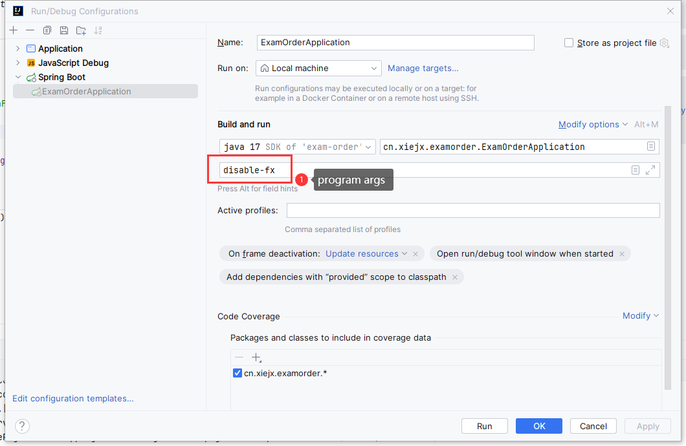
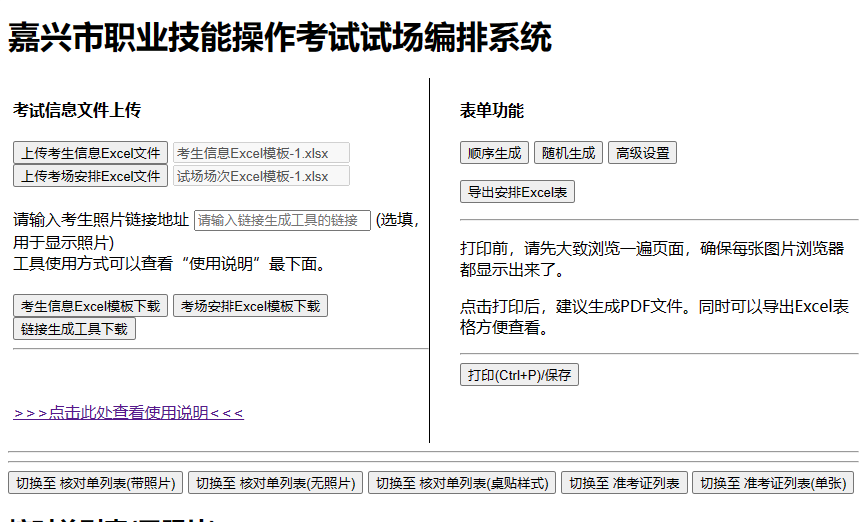

# 考场编排系统简要说明
## 系统架构
### 前端
- 基于简单的 Vue.js 框架，不使用 Vue-cli 和 WebPack。
### 后端
- 基于 Java 17 的 Spring Boot 3.x 框架。可选是否启用 JavaFx 作为启动界面。
# 系统使用
## 源码编译以及运行
### 编译
请使用 IntelliJ IDEA Clone 本项目，并设置 JDK 版本为 17，然后使用 Maven 编译。本项目没有特殊依赖，可以直接刷新 Maven 依赖即可完成编译。
### 运行
一般选择禁用 JavaFx 启动本程序，以纯后端服务来运行。需要在 program arguments 中添加 `disable-fx` 参数。如下图所示：

然后构建并运行本程序，浏览器默认端口号为 13322，直接访问 `http://127.0.0.1:13322` 即可访问本程序。
## 直接运行
从 release 处下载最新的 release 版本的 jar 包程序，并在本地已有 JDK 17，使用命令 `java -jar xxxxxx.jar disable-fx` 即可启动。浏览器默认端口号为 13322，直接访问 `http://127.0.0.1:13322` 即可访问本程序。
# 系统截图
